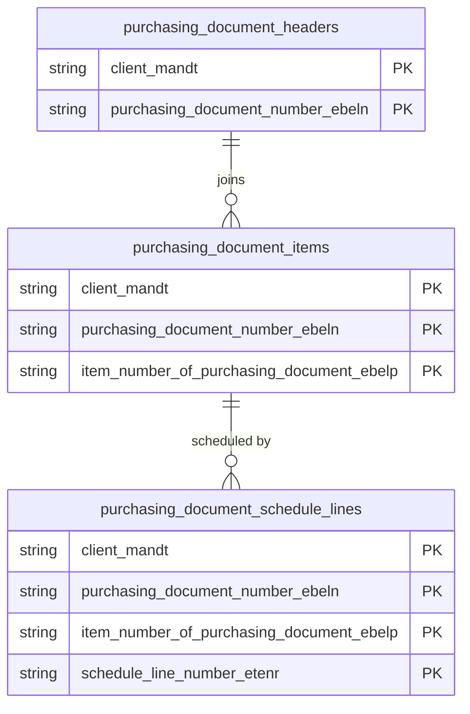

# Purchasing Documents Data Product

Tracks enterprise procurement activity spanning purchase orders, scheduling agreements, and contract frameworks. It yields critical insights into supplier lead-time compliance, spending analytics, and automated procurement workflow efficiency.

## 1. Overview & Business Value

*   **Business Purpose:** Tracks enterprise procurement activity spanning purchase orders, scheduling agreements, and contract frameworks. It yields critical insights into supplier lead-time compliance, spending analytics, and automated procurement workflow efficiency.

*   **Key Metrics & Use Cases:**
    *   **Metric/Use Case 1:** Unified enterprise reporting and operational tracking.
    *   **Metric/Use Case 2:** High-fidelity analytics and AI-ready data ingestion.

## 2. Data Assets Catalog

This data product exposes the following BigQuery data assets:

| Data Asset | Description | Source Systems |
| :--- | :--- | :--- |
| `purchasing_document_headers` | Tracks administrative and commercial terms of SAP purchase orders, scheduling agreements, and contracts from EKKO, maintaining transaction dates, vendors, currencies, and payment terms. | `SAP ECC` / `SAP S/4HANA` |
| `purchasing_document_items` | Manages detailed transactional item lines from SAP EKPO, representing ordered materials, quantities, pricing components, plants, and account assignment references. | `SAP ECC` / `SAP S/4HANA` |
| `purchasing_document_schedule_lines` | Captures logistical delivery schedules from SAP EKET, specifying delivery dates, scheduled quantities, and received/issued quantities for each item line. | `SAP ECC` / `SAP S/4HANA` |

### Entity Relationship Diagram (ERD)

## 3. Data Foundation & Source Tables

To build these assets, the following source tables must be available in the data foundation layer:

| Source Table | Name / Description | System Source | Used by Asset(s) |
| :--- | :--- | :--- | :--- |
| `ekko` | Operational source table. | `Common` | `purchasing_document_headers`, `purchasing_document_items` |
| `ekpo` | Operational source table. | `Common` | `purchasing_document_items` |
| `eket` | Operational source table. | `Common` | `purchasing_document_schedule_lines` |

## 4. Transformations & Design Decisions

This section details the critical engineering and design decisions behind the transformations.

### A. Granularity & Primary Keys

* **purchasing_document_headers:** Client (`client_mandt`) and Purchasing Document Number (`purchasing_document_number_ebeln`).
* **purchasing_document_items:** Client (`client_mandt`), Purchasing Document Number (`purchasing_document_number_ebeln`), and Item Number (`item_number_of_purchasing_document_ebelp`).
* **purchasing_document_schedule_lines:** Client (`client_mandt`), Purchasing Document Number (`purchasing_document_number_ebeln`), Item Number (`item_number_of_purchasing_document_ebelp`), and Schedule Line Delivery Serial Number (`schedule_line_number_etenr`).
* **purchasing_document_headers:** `client_mandt` and `purchasing_document_number_ebeln`.
* **purchasing_document_items:** `client_mandt`, `purchasing_document_number_ebeln`, and `item_number_of_purchasing_document_ebelp`.
* **purchasing_document_schedule_lines:** `client_mandt`, `purchasing_document_number_ebeln`, `item_number_of_purchasing_document_ebelp`, and `schedule_line_number_etenr`.

### B. Joins & Relationship Logic

* **purchasing_document_headers:**
* `ekko` is LEFT JOINed to the `date_dimension` table on `aedat` (change date) and `bedat` (purchasing document date) to resolve detailed calendar metrics.
* **purchasing_document_items:**
* `ekpo` is INNER JOINed to `ekko` on `mandt` and `ebeln` to retrieve the active currency key (`waers`) and document categories.
* `ekpo` is LEFT JOINed to the `date_dimension` table on `aedat` (change date) to resolve calendar attributes.
* `ekko` document currency keys are matched against the `currency_decimal` CTE (sourced from `tcurx`) to apply proper decimal shifting on price (`netpr`), gross order value (`brtwr`), net order value (`netwr`), and condition values.
* **purchasing_document_schedule_lines:**
* `eket` is LEFT JOINed to the `date_dimension` table on `eindt` (delivery date) and `sldat` (scheduled date) to pull calendar tracking properties.

### C. Incremental Load Strategy

*   **Supported Materialization Types:** `incremental` | `table` | `view`
*   **Incremental Logic:**
* **purchasing_document_headers:** Incremental delta filtering is driven by the `recordstamp` of the `ekko` table.
* **purchasing_document_items:** Employs `GREATEST` on `ekpo.recordstamp` and `ekko.recordstamp` to ensure any header or item changes trigger a reload.
* **purchasing_document_schedule_lines:** Incremental updates are based on the `recordstamp` of the `eket` source table.

### D. ERP Source System Differences (ECC vs. S/4HANA)

* **purchasing_document_headers:** No schema differences. Shared unified code structure.
* **purchasing_document_items:** No schema differences. Structures are identical.
* **purchasing_document_schedule_lines:** No schema differences. Shared unified code structure.
* Field Selections:**
* **purchasing_document_headers:** Captures header parameters (e.g., document type `bsart`, vendor `lifnr`, terms `zterm`, purchasing org `ekorg`, currency `waers`, and release strategy fields) alongside calendar properties.
* **purchasing_document_items:** Selects key operational fields (e.g., material `matnr`, plant `werks`, quantities, target values, and valuation codes) with appropriate currency shifts.
* **purchasing_document_schedule_lines:** Extracts scheduling attributes (e.g., delivery date `eindt`, scheduled quantity `menge`, and goods receipt quantity `wemng`) aligned with calendar fiel

### E. Field Conversions & Calculations

*   **Currency & Conversions:** Standardized using built-in currency shift logic for currencies with non-standard decimal formats (e.g. JPY, IDR).
*   **Field Selections:** Enriched with operational data and standard language text mappings where applicable.

## 5. Change Log

| Date | Type of change | Change details |
| :--- | :--- | :--- |
| 24.06.2026 | Release | Release candidate validation completed. |
